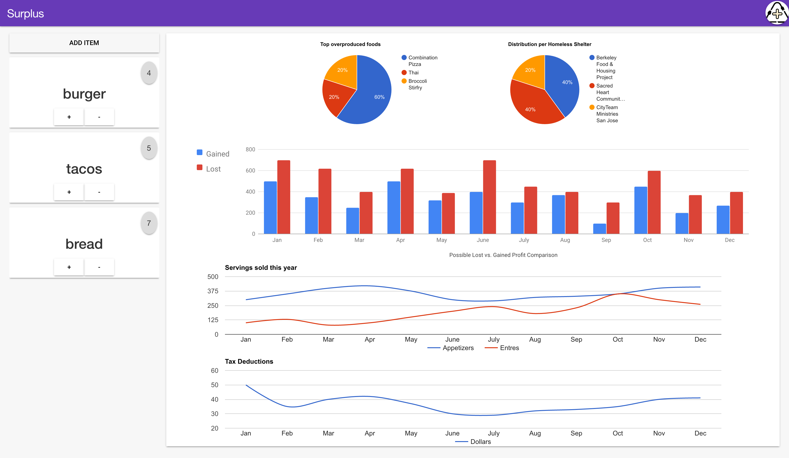

# Surplus

🔥 3rd place at BroncoHack 2017! 🔥  

Written using preact, webpack, preact-mdl and love!

Our goals with Surplus was to be able to help offset waste foods from restaurants by allowing them to sell their leftovers for discounted prices to homeless shelters. Furthermore, we brought analytics into play so that the restaurants could see what foods they may be overproducing to help curb excess waste before it even begins.  

## Screenshots  
### Login Page with error handling for invalid parameters  

   

### Dashboards for the restaurant and homeless shelter respectively  

   

## Installation
1) Clone this repo  
2) Run `npm install` and then `npm run dev` to set up the dev server  
3) To set up a test production server run `npm run start`

## Usage  
1) Restaurant account name: `restaurant` with password: `123abc`  
2) Homeless shelter account name: `shelter` with password: `123abc`  

## Code Goals
- [ ] Modularize code and decrease inline styling
- [ ] Update dependencies (Webpack 2 and preact 8)
- [ ] Get rid of all unused CSS
- [ ] Replace Google charts with a more preact friendly lib
- [ ] Increase performance/render times